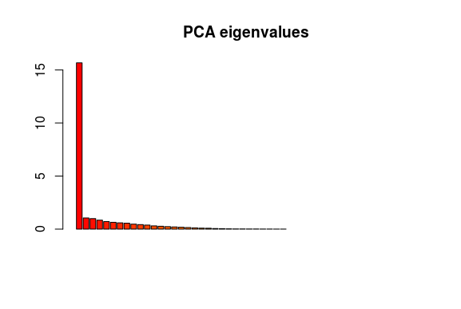
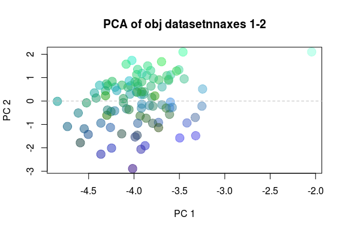

# Bioinformatica Avanzada
###### Castillo Franco Yared Jafet
## Genética de poblaciones con R
### PCA

Se designa un directorio de trabajo.

Comando:
- setwd("/home/yared/Bioinformatica/R Studio/")

Se cargan las librearias Adegenet y Wordcloud.

Comandos:
- library(adegenet)
- library(wordcloud)

Se carga la base de datos y se visualiza un resumen de la base de datos para ver el numero de individuos.

Comando:
- obj=read.fstat("robert.dat")
- summary(obj)

Se convierte a genpop y se visualiza el número de poblaciones.

Comando:
- obj2 = genind2genpop(obj)
- obj2

Ejemplo:

##### Base de datos "Truchas.dat"

Se extrae la ausencia de alelos y las NAs se reemplazan.

Comando:
- X = tab(obj, NA.method="mean")

##### Se realiza el PCA

Comandos:
- pca1 = dudi.pca(X,scannf=FALSE,scale=FALSE)
- temp = as.integer(pop(obj))
- myCol = transp(c("blue","red","orange","green","pink","purple"),.96)[temp]
- myPch = c(0,1,2,5,6,8)[temp]

Nota: En comando myCol, usar el numero de colores de acuerdo al numero de polaciones, seguido del numero de individuos (para este caso son 6 polaciones y 96 individuos).

##### Se realiza un gráfica sencilla usando WordCloud

Comandos:
- plot(pca1$li, col=myCol, cex=3, pch=myPch)
- textplot(pca1$li[,1], pca1$li[,2], words=rownames(X), cex=1.4, new=FALSE)
- abline(h=0,v=0,col="grey",lty=2)
- s.arrow(pca1$c1*.5, add.plot=TRUE)
- legend("topright", pch=c(0,1,2,5,6,8), col=transp(c("blue","red","orange","green","pink","purple"),.96), leg=c("Pob A","Pob B" ,"Pob C" ,"Pob D" ,"Pob E" ,"Pob F"), pt.cex=2)

Ejemplo:

##### Base de datos "Truchas.dat"

##### Gráficos

Comandos:
- pca1 <- dudi.pca(X,cent=FALSE,scale=FALSE,scannf=FALSE,nf=3)
- barplot(pca1$eig[1:50],main="PCA eigenvalues", col=heat.colors(50))

Ejemplo:

##### Base de datos "Truchas.dat"

Comandos:
- s.label(pca1$li)
- title("PCA of obj1 datasetnnaxes 1-2")
- add.scatter.eig(pca1$eig[1:20], 3,1,2)

Ejemplo:

##### Base de datos "Truchas.dat"

Comandos:
- s.class(pca1$li, pop(obj))
- title("PCA of obj datasetnnaxes 1-2")
- add.scatter.eig(pca1$eig[1:20], 3,1,2)

Ejemplo:

##### Base de datos "Truchas.dat"

Comandos:
- s.class(pca1$li,pop(obj),xax=1,yax=3,sub="PCA 1-3",csub=2)
- title("PCA of obj datasetnnaxes 1-3")
- add.scatter.eig(pca1$eig[1:20],nf=3,xax=1,yax=3)

Ejemplo:

##### Base de datos "Truchas.dat"

Comandos:
- col <- funky(15)
- s.class(pca1$li, pop(obj),xax=1,yax=3, col=transp(col,.6), axesell=FALSE, cstar=0, cpoint=3, grid=FALSE)

Ejemplo:

##### Base de datos "Truchas.dat"

Comandos:
- colorplot(pca1$li, pca1$li, transp=TRUE, cex=3, xlab="PC 1", ylab="PC 2")
- title("PCA of obj datasetnnaxes 1-2")
- abline(v=0,h=0,col="grey", lty=2)

Ejemplo:

##### Base de datos "Truchas.dat"

Comandos:
- colorplot(pca1$li[c(1,3)], pca1$li, transp=TRUE, cex=3, xlab="PC 1", ylab="PC 3")
- title("PCA of microbov datasetnnaxes 1-3")
- abline(v=0,h=0,col="grey", lty=2)

Ejemplo:

##### Base de datos "Truchas.dat"

### Arbol de Neighbor-Joining

Se cargan las librerias.

Comandos:
- library("devtools")
- library("pegas")
- library("hierfstat")
- library("ape")

Se corre un estadístico F, concretamente el índice de fijación, el cual nos dice el nivel de diferenciación genetica entre poblaciones.

Comando:
- Fst(as.loci(obj))

Para saer si estos valores son significativos, se usa la prueba de G-estadística.

Comandos:
- Gtest <- gstat.randtest(obj,nsim=99)
- Gtest
- plot(Gtest)

Ejemplo:

##### Base de datos "Truchas.dat"

Se mide la distancia entre poblaciones.

Comandos:
- matFst <- pairwise.fst(obj[1:96])
- matFst
- obj.matFst <- pairwise.fst(obj,res.type="matrix")
- obj.matFst[1:6,1:6]

Ejemplo:

##### Base de datos "Truchas.dat"

##### Se contruye el árbol de Neighbor-Joining

Comandos:
- obj.tree <- nj(obj.matFst)
- plot(obj.tree, type="unr", tip.col=funky(nPop(obj)), font=2)
- annot <- round(obj.tree$edge.length,2)
- edgelabels(annot[annot>0], which(annot>0), frame="n")
- add.scale.bar()

Ejemplo:

##### Base de datos "Truchas.dat"

### Hetrocigosis esperada entre poblaciones

Se calcula la hetrocigosis esperada entre poblaciones dentro de un objeto genpop. Nos ayuda a medir al diversidad genetica.

Comando:
- Hs(genind2genpop(obj))

Ejemplo:

##### Base de datos "Truchas.dat"

### Número de alelos y hetrocigosis observada

Para obetener el número de alelos y la heterocigosis observada, primero se carga la libreria strataG para poder convertir la base de datos de genind a gtype:
- library("strataG")

Comandos:
- obj3=genind2gtypes(obj)
- obj3

Ejemplo:

##### Base de datos "Truchas.dat"

### Minimum Spanning Network

Para hacer el minimum spanning network, primero se cargan las librerias correspondientes:
- library("poppr")
- library("magrittr")

Para realizar el minimum spanning network se usa el comando "imsn()", el cual abre una ventana interactiva, en la cual se tiene que seleccionar la base de datos, y dar click en go.

Comando:
- imsn() 

Ejemplo:

##### Base de datos "Truchas.dat"

### Indices de Evenness

El indice de Evenness nos dice con datos numericos que tanc erca esta una especie en cierto ambiente.

Para calcularlo, primero se carga la libreria correspondiente:
- library ("poppr")

Comando:
- locus_table(obj[pop = 1])

Ejemplo:

##### Base de datos "Truchas.dat"
